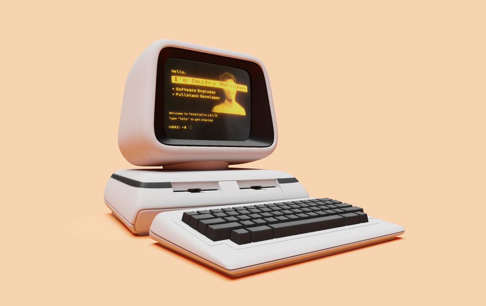

# 🧠 Terminalio



---

## 📖 Overview

**Terminalio** is an interactive 3D terminal and personal resume built with **TypeScript** and **Three.js**.  
It simulates a command-line interface within a **WebGL** environment, combining a realistic console experience with smooth 3D rendering.

---

## 🚀 Features

The terminal supports several common bash-like commands:

| Command | Description |
|----------|-------------|
| `ls` | Lists the contents of the current directory |
| `cd` | Changes the current directory |
| `pwd` | Prints the current working directory |
| `echo` | Outputs the given text |
| `show` | Displays file contents of (.md, .txt, .png and other formats) |
| `clear` | Clears the terminal screen |
| `hello` | Prints a greeting message |
| `help` | Displays available commands and their descriptions |

---

## ⚙️ Installation & Usage

```bash
# Clone the repository
git clone https://github.com/paranoica/root-terminalio.git

# Navigate to the project directory
cd terminalio

# Install dependencies
npm install

# Start the development server
npm run dev

# Build for production in the dist/ directory
npm run build